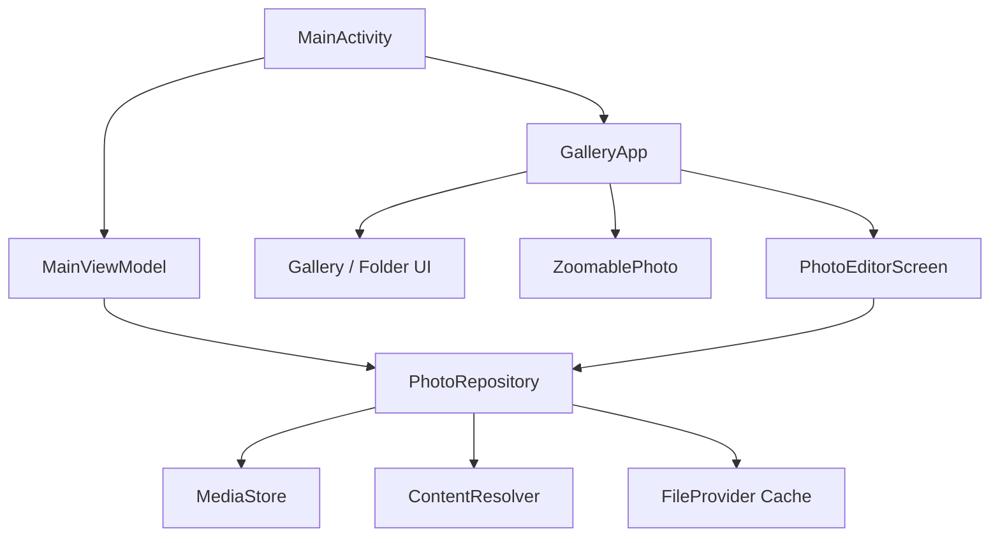

# 系統架構與技術文件

## 技術摘要

| 項目 | 技術 |
| --- | --- |
| 語言 | Kotlin 2.1.10 |
| UI | Jetpack Compose、Material 3 |
| 圖片載入 | Coil 2.7.0、BitmapFactory、ImageDecoder |
| 狀態 | ViewModel、StateFlow、Compose state |
| 非同步 | Kotlin Coroutines |
| 儲存 | MediaStore、SharedPreferences、FileProvider |
| 最低版本 | Android 8.0 / API 26 |
| 目標版本 | API 35 |
| Java | 17 |

## 分層架構

### Activity 層

`MainActivity` 負責：

- Edge-to-edge 視窗與主題套用。
- Android 圖片權限要求。
- 接收 `ACTION_VIEW` 與 `ACTION_EDIT`。
- 啟動系統分享及刪除確認流程。

### 狀態層

`MainViewModel` 管理：

- `GalleryUiState`：圖片清單、載入及錯誤狀態。
- `GalleryUiState`：圖片分頁、載入更多、錯誤與 MediaStore 變更狀態。
- 外部圖片開啟要求與 `VIEW`／`EDIT` 模式。
- 顯示模式，並透過 SharedPreferences 保存。

### 資料層

`PhotoRepository` 封裝：

- MediaStore 圖片查詢及排序。
- MediaStore 分頁查詢、穩定日期排序與 ContentObserver 刷新。
- 外部 `content://` URI 中繼資料解析。
- JPEG 輸出至公開 Pictures 目錄。
- 依 Bitmap alpha 狀態輸出 PNG 或 JPEG。
- 分享暫存檔與 FileProvider URI。

### UI 層

- `GalleryApp`：以 sealed `Screen` 管理 Gallery、Settings、Viewer 與 Editor。
- `ZoomablePhoto`：處理雙擊、雙指縮放、拖曳與 Viewport 轉換。
- `PhotoEditorScreen`：管理 Bitmap、向量筆畫、裁切區域、工具狀態與匯出。
- `PhotoEditorViewModel`：保存編輯筆畫、復原／重做、裁切與 dirty state。
- `Theme.kt`：Material 3 色彩與深淺主題。

## 資料模型

### Photo

`Photo` 保存 MediaStore 或外部 URI 的識別碼、URI、名稱、尺寸、檔案大小、日期、資料夾與 MIME 類型。

### PhotoViewport

以 `scale`、`centerX`、`centerY` 描述圖片縮放與中心位置，避免直接保存依裝置尺寸變動的像素位移。

### EditStroke

編輯筆畫包含正規化座標點、顏色、正規化筆寬與工具類型。固定 dp 粗細會在落筆時依圖片 1x 顯示尺寸轉成正規化寬度，因此不同圖片在畫面上的基準粗細一致。

## 圖片編輯管線

1. `ImageDecoder` 或 `BitmapFactory` 載入 Bitmap，長邊超過 4096 時取樣；API 26、27 另套用 EXIF orientation。
2. 使用正規化座標保存筆畫，畫面預覽依目前圖片 bounds 即時繪製。
3. 旋轉與水平翻轉會同步轉換 Bitmap 與筆畫座標，保留復原歷史。
4. 裁切會先合併效果，再對 Bitmap 裁切並重設筆畫歷史。
5. 匯出時在 Bitmap 副本套用模糊與標註圖層；含透明度時輸出 PNG，否則輸出 JPEG 品質 95。

## 權限與版本差異

- API 33 以上：`READ_MEDIA_IMAGES`。
- API 34 以上：另支援 `READ_MEDIA_VISUAL_USER_SELECTED`。
- API 32 以下：`READ_EXTERNAL_STORAGE`。
- API 28 以下另宣告 `WRITE_EXTERNAL_STORAGE`。
- API 29 刪除使用 `RecoverableSecurityException`。
- API 30 以上刪除使用 `MediaStore.createDeleteRequest`。

## 已知技術限制

- 裁切屬於破壞式編輯，套用後無法逐筆復原先前筆畫。
- 編輯狀態可跨組態變更保存；程序被系統完全終止後不保證恢復完整筆畫。
- 目前已有圖片排序、編輯狀態、刪除位置與縮放計算單元測試，仍應執行實機回歸測試。
- UI 文字目前直接寫在 Compose 程式碼中，尚未抽離為多語系資源。
