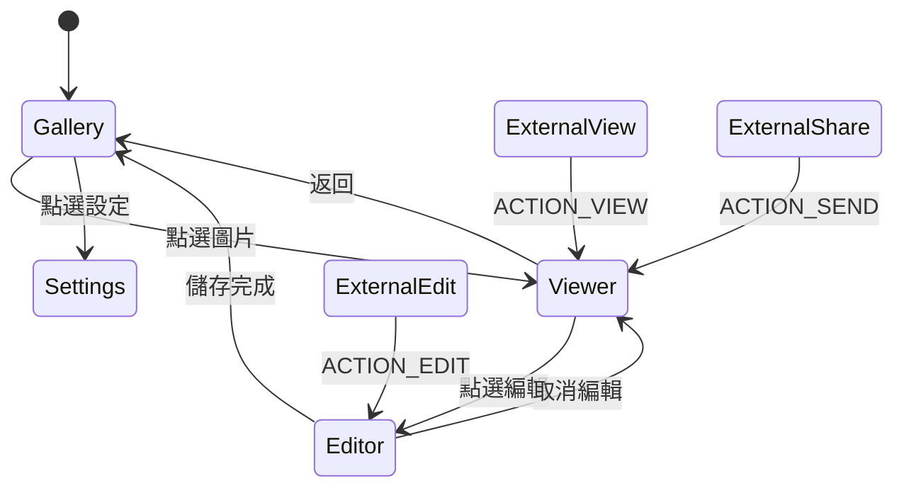

# 系統設計文件

## 設計目標

- 提供快速、簡潔且完全在裝置本機運作的相片瀏覽器。
- 在 Android 不同媒體權限模型下維持可預期的行為。
- 編輯時優先保留原始檔，所有儲存操作皆另存新檔。
- 讓不同解析度圖片在 1x 顯示時具有一致的工具粗細。
- 支援由其他 App 或系統截圖流程直接檢視與編輯圖片。

## 功能需求

### 圖庫

- 依日期顯示圖片。
- 依資料夾分類圖片。
- 提供重新整理、設定與權限空狀態。

### 瀏覽器

- 支援單擊顯示控制列、雙擊縮放切換、雙指縮放及拖曳。
- 可查看資訊、分享、刪除及進入編輯器。
- 每張圖片保有獨立 Viewport 狀態。

### 編輯器

- 支援畫筆、螢光筆、橡皮擦、模糊、裁切、旋轉及水平翻轉。
- 支援筆畫復原與重做。
- 工具範圍統一為線性 `5dp..32dp`。
- 保存各工具位置及畫筆顏色偏好。
- 支援另存與分享，不覆蓋原始圖片。

## 非功能需求

- 圖片處理不得依賴網路。
- 外部圖片僅在收到的 URI 授權範圍內讀取。
- 長邊超過 4096 的圖片應取樣，降低記憶體壓力。
- 非同步 I/O 不得阻塞主執行緒。
- Release 類型建置應可啟用 R8 最佳化。

## 導覽狀態

`GalleryApp` 使用 sealed interface 表示畫面，避免引入額外 Navigation 依賴。單張圖片分享會沿用外部瀏覽流程；外部圖片另以 `returnToExternal` 與 `directExternalEdit` 控制返回目的地。

## 編輯狀態設計

- `bitmap`：目前基底圖片，不包含尚未合併的向量筆畫。
- `strokes`：已套用筆畫堆疊。
- `redoStrokes`：已復原、可重做的筆畫堆疊。
- `currentStroke`：手勢進行中的即時筆畫。
- `blurSource`：降低解析度後再放大的模糊來源。
- `cropRect`：以 0 到 1 正規化座標保存裁切範圍。

新增筆畫會清空 redo；復原會把最後筆畫移至 redo；重做則反向移回。旋轉及翻轉會轉換兩個堆疊中的座標，因此不會破壞歷史。

## 儲存設計

### 一般儲存

- Android 10 以上使用 `MediaStore` 與 `RELATIVE_PATH`。
- 寫入期間使用 `IS_PENDING`，完成後才公開。
- Android 9 以下寫入公開 Pictures 子目錄。

### 分享

- 寫入 App cache 的 `shared` 子目錄。
- 使用 FileProvider 產生可授權 URI。
- 自動清除超過 24 小時的舊分享暫存檔。

## 錯誤處理

- 圖庫錯誤顯示重試畫面。
- 圖片解碼錯誤顯示於編輯畫面。
- 儲存失敗透過 Snackbar 顯示訊息。
- 刪除由 Android 系統處理授權與確認。

## 安全與隱私

- 不宣告網路權限，也沒有遠端 API。
- 不保存原始圖片內容到 App 私有資料庫。
- 分享 URI 使用一次性權限旗標，不暴露實際檔案路徑。
- `prerelease` 使用 Debug 金鑰，只供測試；正式發行必須改用妥善保管的正式簽章。
